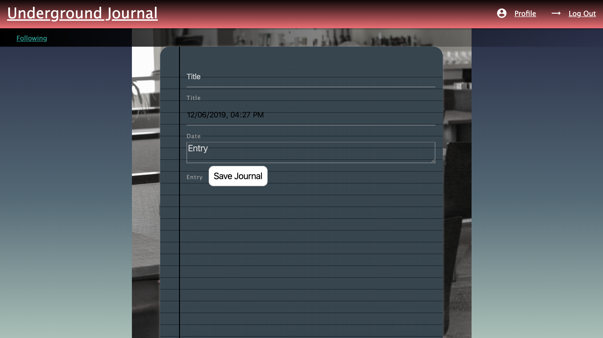
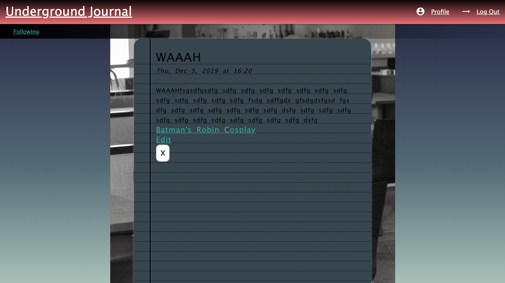

# Underground Journal
#### A journal sharing platform to keep track of your journals and share journals with other people. See what other people's days, struggles, joys, and tragedies are like and comment on them.

    
	
	
	

## Technologies Used
- HTML
- CSS
- JavaScript
- Express.js
- MongoDB
- Mongoose
- Embedded JavaScript

## Getting Started
Go to this link to start using the website
[Underground Journal](https://underground-journal.herokuapp.com/posts "Underground Journal")

## Next Steps
1. Improve Styling and UI
2. Allow anonymity when posting
3. Create filters and search bar functionality
4. Create image upload functionality
5. Allow journals to be private
6. Allow users to like posts
7. Allow users to view posts that they liked or commented on.
8. Allow users to follow other users.
9. Expand beyond journals and style UI and functionality for other entries such as poems.
